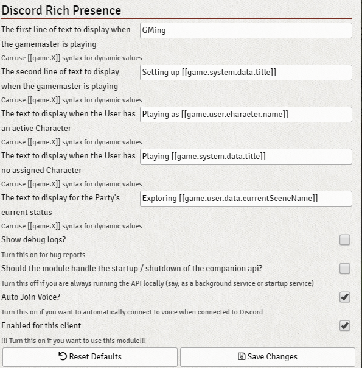

# FoundryVTT Discord Rich Presence

Enables Discord Rich Presence and Voice Chat for http://foundryvtt.com/

## Check out the Wiki!

**Installation:** https://github.com/cswendrowski/FoundryVTT-Discord-Rich-Presence/wiki/Initial-Setup

**FAQ:** https://github.com/cswendrowski/FoundryVTT-Discord-Rich-Presence/wiki/FAQ

## Features

1) GM-only display, so you don't leak your secret plans!

2) Player display!

3) Configurable!

4) Discord Invites!

5) Voice Chat!

